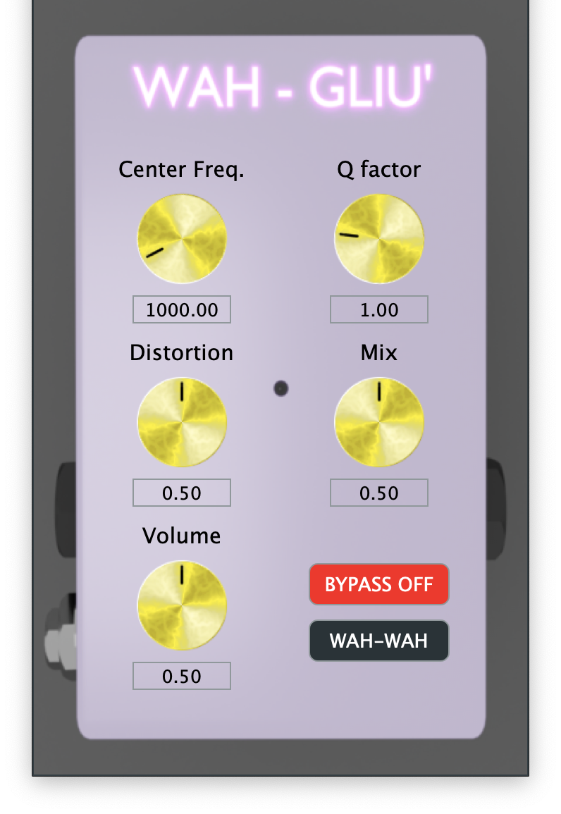
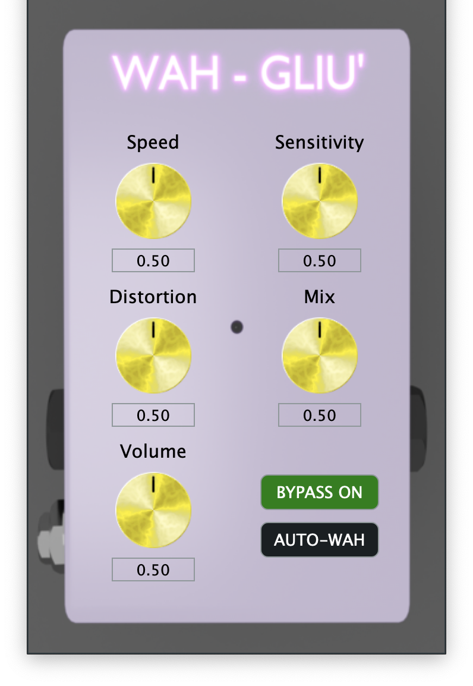

## Wah-Wah and Auto-Wah with distortion mixing
#### CMLS 2022 - HW 2

## Folder structure
```bash
.
├── Wahgliu
│   ├── Resources
│   │   ├── autowah.png
│   │   ├── background.png
│   │   ├── knobImg.png
│   │   ├── realegetir.png
│   │   ├── waghliu.png
│   │   └── wahwah.png
│   ├── Source
│   │   ├── PluginEditor.cpp
│   │   ├── PluginEditor.h
│   │   ├── PluginProcessor.cpp
│   │   ├── PluginProcessor.h
│   │   ├── SliderLookAndFeel.cpp
│   │   └── SliderLookAndFeel.h
│   └── Wahgliu.jucer
├── readme.md
└── report HW2 - TheGetirs.pdf
```

# Introduction
"Wah-gliù" is a VST Plug-In that emulates the functions of a Wah-Wah pedal and more. It has two main modes: Wah-Wah and Auto-Wah.

# Plug-in Usage
Compile the .vst3 file and launch it into your preferred DAW. 

To use the wah-wah mode, we suggest to map the central frequency parameter to an external MIDI controller (e.g. expression pedal, sliders, knobs, ...) to get the best exprerience. We also suggest to use Ableton Live to get the best results. 

# Implementation 
"Wah-gliù" is a VST implemented in C++ through the applicative framework JUCE.

## Wah-Wah
With the Wah-Wah function ON, the effect works like a typical wah-wah pedal. Looking at the GUI, the following knobs can be used to customize the effect:
- Center frequency: moves the center frequency of the peaking filter applied to the wet signal.
- Q factor: acts on the quality factor of the peaking filter applied to the wet signal.
- Distortion: distortion gain applied to the effected signal before filtering.
- Mix: parameter that regulates the ratio between the dry and the wet signal
at the output stage.
- Volume: master volume of the effect.
- Bypass: grants possibility to bypass the effect, hearing the input as-is.

## Auto-Wah
With the Auto-Wah function ON, the effect follows the volume envelope of the input signal. Looking at the GUI, the following knobs can used to customize the effect:
- Speed: regulates how quick the response of the envelope follower is.
- Sensitivity: modifies the filter sweep, i.e. how much the center frequency of the peaking filter follows the envelope of the signal.
- Distortion: distortion gain applied to the effected signal before filtering.
- Mix: parameter that regulates the ratio between the dry and the wet signal
at the output stage.
- Volume: master volume of the effect.
- Bypass: grants possibility to bypass the effect, hearing the input as-is.

## Distortion
"Wah-gliù" has an integrated distortion effect, applied before the filtering phase, that can be used to create some unique effects. 

## GUI
<div>


</div>

## Modules to add
* juce_cryptography
* juce_dsp
* juce_opengl
* juce_video

## Authors
 

Di Palma - Gargiulo - Orsatti - Morena - Perego